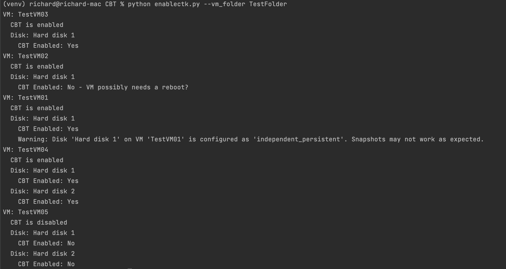

# ChangeBlockTracking
Script to get or set Change Block Tracking on VMware VMs
Created by Richard Garsthagen - December 2024

This script is created to help with the setup of your VMs when using the
Oracle Cloud Migration Service. If you want your VMs to be replicated with only 
the last changes per replication cycle, you need to enable your VMs with Change Block Tracking (CBT)
https://kb.vmware.com/s/article/1020128

If you have disks that are set to independent-persistent mode and want to be able to snapshor those, you
can use the parameter --dependent in combination with the --enable command. This will enable Change
Block Tracking and set the disk mode to dependent-persistent
https://docs.vmware.com/en/VMware-vSphere/7.0/com.vmware.vsphere.vm_admin.doc/GUID-8B6174E6-36A8-42DA-ACF7-0DA4D8C5B084.html

## Configuration:
- Configure a config.ini file your vCenter connection details and credentials. See the config.ini.example
- install requirements: pip install -r requirements.txt

## Usage
```
usage: cbt.py [-h] (--vm_name VM_NAME | --vm_folder VM_FOLDER) [--enable] [--dependent]

Get or Set Change Block Tracking (CBT) on a VM or all VMs in a folder.

options:
  -h, --help            show this help message and exit
  --vm_name VM_NAME     The name of the virtual machine
  --vm_folder VM_FOLDER
                        The path of the folder containing VMs
  --enable              Enable Change Block tracking
  --dependent           Convert independent-persistent disk to dependent-persistent
```

## Usage - Examples

show the status of a VM:
>python cbt.py --vm_name YourVMName

Enable CBT on a VM and its disks
>python cbt.py --vm_name YourVMName --enable

show the status of all VMs in a specific VM Folder
>python cbt.py --vm_folder VMFolderName

Enable CBT on all VMs in a specific VM Folder
>python cbt.py --vm_folder VMFolderName --enable


The script will also check if the VM's disk mode is set to Dependent. 
When the VM's disk mode does not match this, the disk can not have a snapshot. 
This will make OCM fail with replicating the VM.




