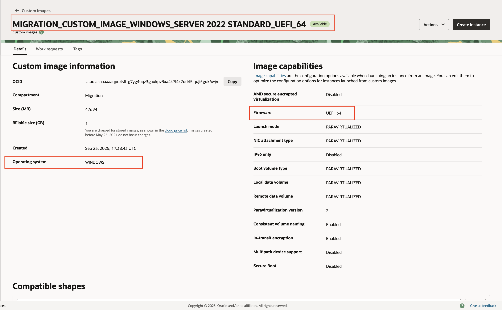
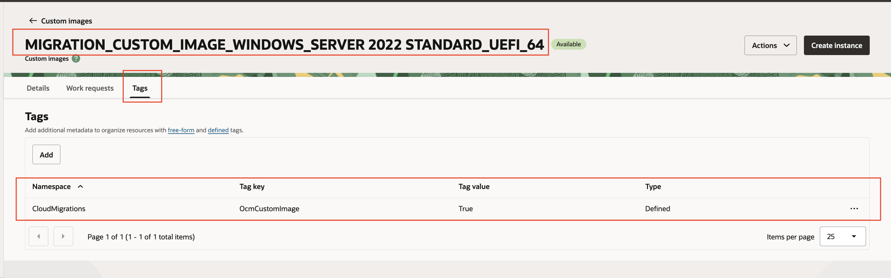
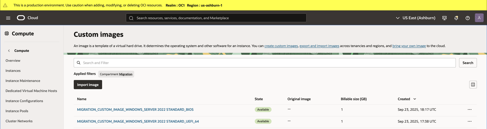

# Custom Windows Image Automation Script (Oracle Cloud Infrastructure)

This script automates the creation of a custom Windows image ("custom image") in Oracle Cloud Infrastructure (OCI).

## Steps
1. If the script is executed with the `--skip_check_custom_image` flag, it creates the custom image. 
2. If the script is executed without the `--skip_check_custom_image` flag:
   1. It checks for an existing custom image with the appropriate tag before continuing. 
   2. If such a tagged image exists with matching OS type and firmware exists, the creation step is skipped. 
   3. If no tagged image exists, it creates the required custom image.
3. It verifies the existence of the `CloudMigrations` tag namespace and the `OcmCustomImage` tag key. If tag key is missing, the tag key is created. 
4. An empty file is uploaded to the specified bucket. 
5. A custom compute image is created using the empty file object from the previous step. 
6. The custom image capabilities are updated. 
7. The object created in step 4 is deleted as part of the cleanup.

## Prerequisites

- Python 3.8+
- Oracle Cloud Infrastructure (OCI) account
- Setup session token: https://docs.oracle.com/en-us/iaas/Content/API/SDKDocs/clitoken.htm

## Installation

1. Clone or download the script.
2. Install dependencies:

```commandline
pip install -r requirements.txt
```
   
## Usage
- **NOTE: Ensure to create session token before running this script, Session token's maximum validity is 1 hr. This scrit can take 10-20 min to execute.**
- Run below command for usage of script
```commandline
python create_custom_image.py -h
```
```commandline
python create_custom_image.py -h
usage: create_custom_image.py [-h] --compartment_id COMPARTMENT_ID [--config_file CONFIG_FILE] [--config_profile CONFIG_PROFILE]
                              [--os_version {Server 2022 standard,Server 2022 datacenter,Server 2019 standard,Server 2019 datacenter,Server 2016 datacenter,Server 2016 standard,Server 2012 r2 datacenter,Server 2012 r2 standard,Server 2012 datacenter,Server 2012 standard,Server 2008 r2 datacenter,Server 2008 r2 enterprise,Server 2008 r2 standard}]
                              --firmware {UEFI_64,BIOS} --bucket_name BUCKET_NAME [--skip_check_custom_image]

OCI Custom Windows Image Automation Script

options:
  -h, --help            show this help message and exit
  --compartment_id COMPARTMENT_ID
                        Migration compartment ID.
  --config_file CONFIG_FILE
  --config_profile CONFIG_PROFILE
  --os_version {Server 2022 standard,Server 2022 datacenter,Server 2019 standard,Server 2019 datacenter,Server 2016 datacenter,Server 2016 standard,Server 2012 r2 datacenter,Server 2012 r2 standard,Server 2012 datacenter,Server 2012 standard,Server 2008 r2 datacenter,Server 2008 r2 enterprise,Server 2008 r2 standard}
                        Windows OS version for the custom image.
  --firmware {UEFI_64,BIOS}
                        Firmware type for the custom image (default: UEFI_64).
  --bucket_name BUCKET_NAME
                        Bucket Name used while creating custom zero byte custom image.
  --skip_check_custom_image
                        Skip the check for a custom image and always create a new one
```

## Output and Resource Validation
1. Custom Image 
   - The script logs the OCID of the created custom image.
   - View custom images in the Oracle Cloud Console:
   - `Compute → Custom Images`. Image names begin with `MIGRATION_CUSTOM_IMAGE_..`
   - Open custom image and verify the OS type, firmware details and tags 
2. Empty file object 
   - Empty file object created for the import are deleted after the image is created. 
   - If the script completes successfully, that object should no longer exist.

## IMPORTANT SUGGESTION
- Create windows custom image of both firmware types UEFI_64 and BIOS.

## Disclaimer:
This script is provided for experimental purposes only and should not be used in production. It is provided to assist your development or administration efforts and provided “AS IS” and is NOT supported by Oracle Corporation. The script has been tested in a test environment and appears to work as intended. You should always run new scripts on a test environment and validate and modify the same as per your requirements before using on your application environment.
